## 问题现象

测试环境应用报错无法连接数据库，提示too many connections

## 分析过程

- 在mysql客户端执行 `show full processlist` ，发现连接数已经到达了最大连接数1000
    
    
    
    我们发现在这些连接中，有大量的sleep的连接，并且都指向同一台机器。接下来就随机找一个进程进行分析。此处选取 `172.168.30.91:19118`
    
- 客户端进程分析
    
    登陆到`172.168.30.91` 服务器，查询端口占用情况。
    
    ```
    [root@dtjoy-node4 ~]# netstat -apn | grep 19118
    172.168.30.91:19118     172.168.30.26:3006      CLOSE_WAIT  3540597/java        
    ```
    
    根据上面的结果发现，是3540597这个java进程在使用这个连接。
    
    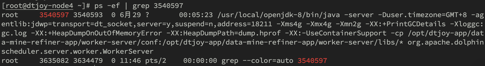
    
    执行进程查询命令，发现Dolphinscheduler的worker进程在使用这个连接。
    
- 应用分析
    
    由于java应用目前是部署在docker容器中，我们需要进入docker容器。
    
    ```bash
    docker exec -it dd-worker-server bash
    ```
    
    然后，查看应用在容器中的进程pid
    
    ```bash
    root@dtjoy-node4:/opt/dtjoy-app/data-mine-refiner-app# jps
    18321 Jps
    19 WorkerServer
    ```
    
    接下来，我们通过查看应用的线程栈来分析哪些线程在使用这些连接
    
    ```bash
    ## 获取当前线程栈
    jstack -l 19 > worker-server/logs/stack.log
    ```
    
- 线程栈分析
    
    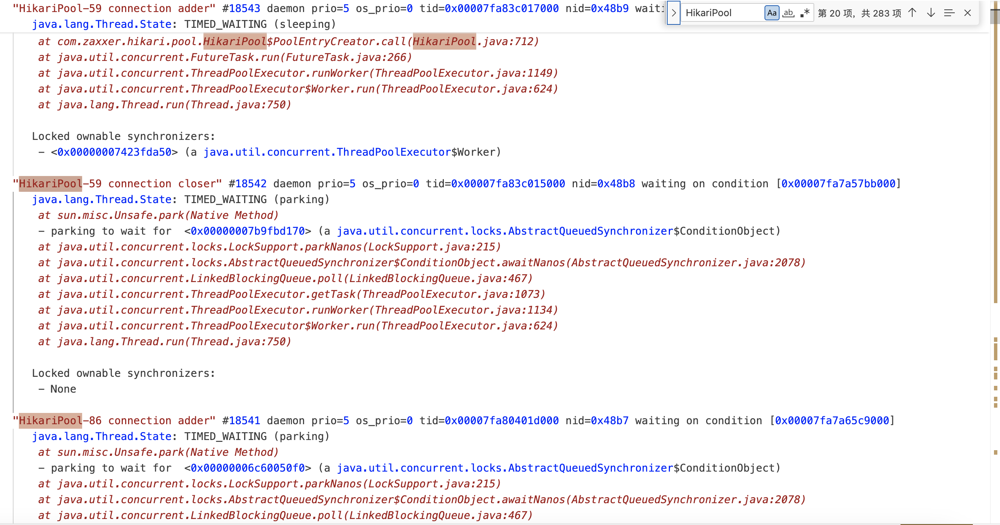
    
    在这里面，我发现有大量的HikariPool相关的线程，看起来数量远远超出了正常的值。数据开发服务除了自身应用会使用到线程池之外，在执行SQL相关的任务也会使用到线程池，前者是在服务启动时就初始化好了线程池，后续不会增加了；那我们定位出来 ，问题应该是出现在后面的相关代码中。
    
- 代码分析
    
    找到SQL执行相关代码入口：
    
    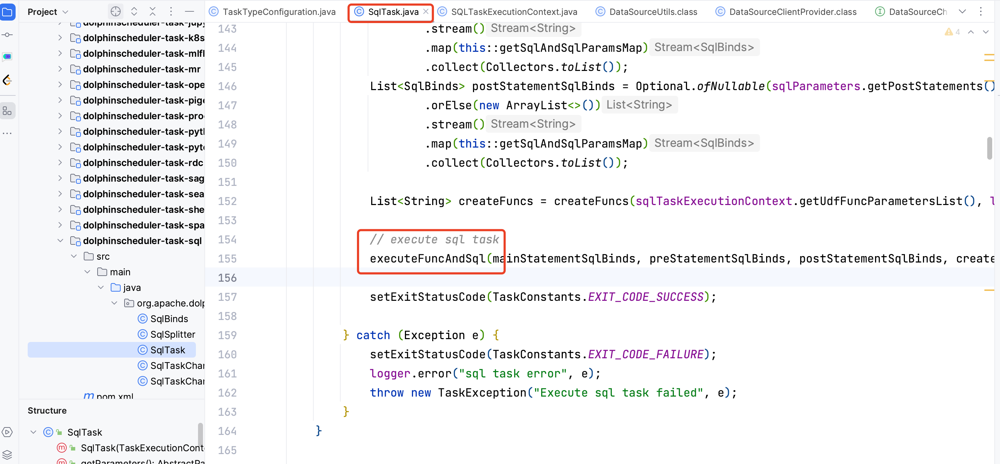
    
    进入方法后，找到获取连接的方法：
    
    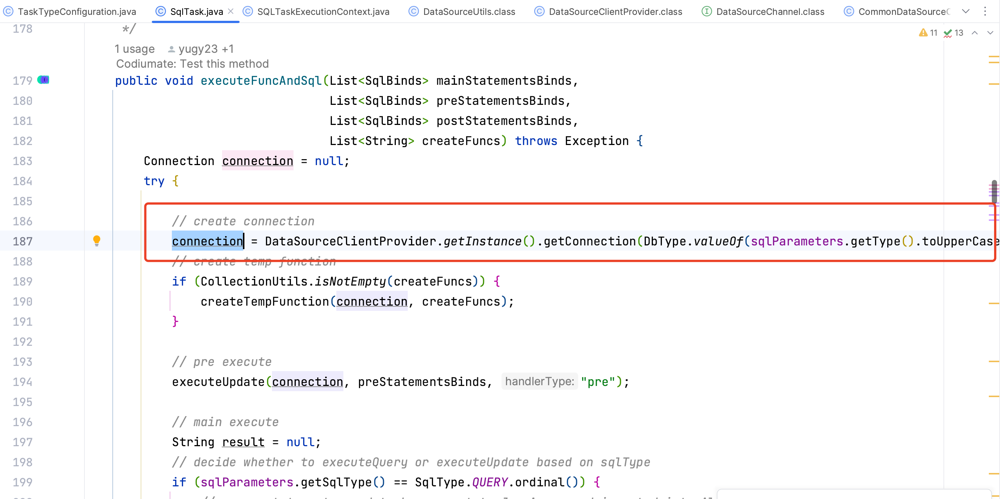
    
    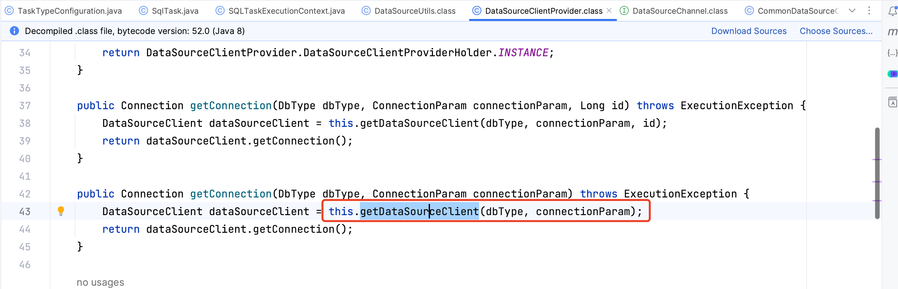
    
    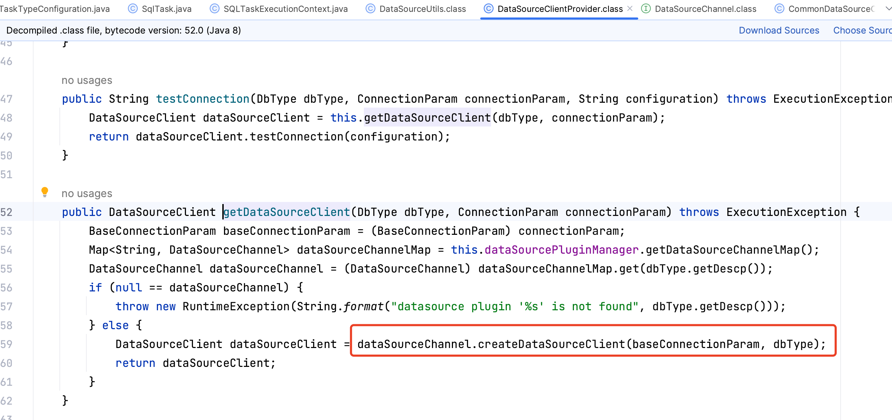
    
    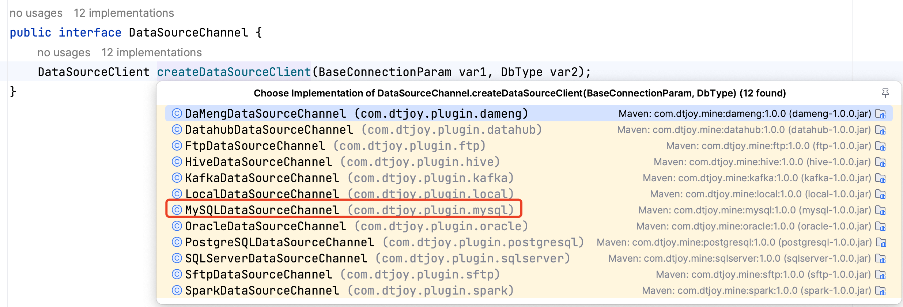
    
    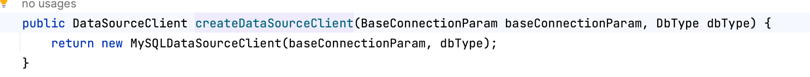
    
    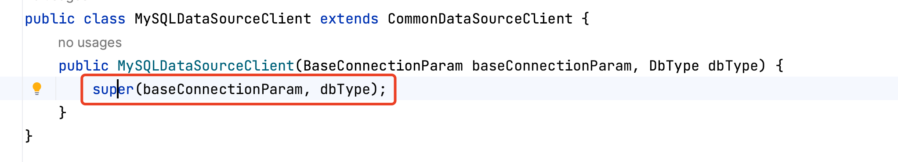
    
    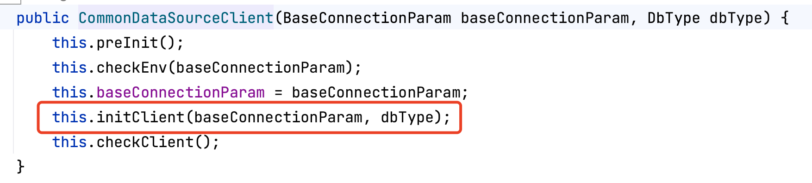
    
    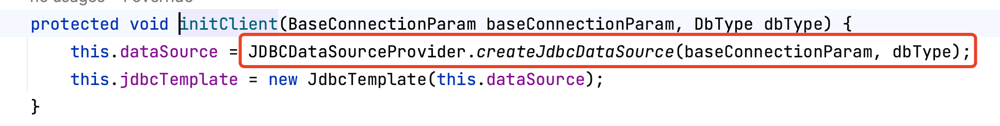
    
    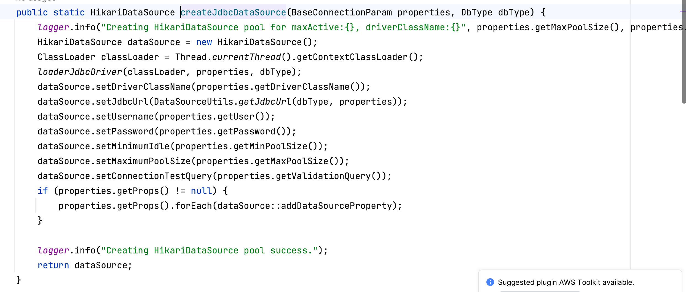
    
    此处，我们可以看到，在每次执行sql的时候，都会去创建一次数据源连接池，而不是使用已经创建好的连接池。所以连接泄露问题的根源就在这里。